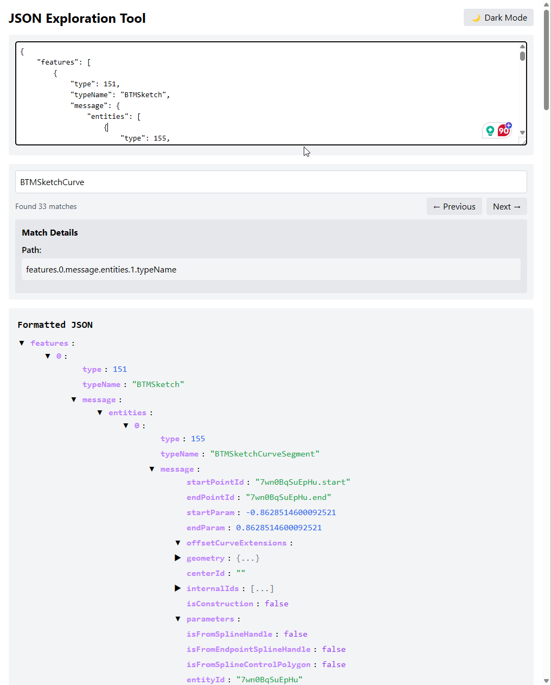

# JSON Viewer and Explorer

An interactive tool for viewing, exploring, and searching through complex JSON data structures.



## Features

### JSON Visualization
- Collapsible tree view for nested JSON structures
- Syntax highlighting for different data types (strings, numbers, booleans, null)
- Error reporting for invalid JSON input

### Advanced Search Capabilities
- Search through both keys and values in your JSON data
- Navigate through search results with Previous/Next buttons
- Automatic expansion of parent nodes when navigating search results
- Visual highlighting of the current search result
- Auto-scrolling to keep the current result in view

### Interactive Controls
- Expand/collapse individual nodes
- "Open Similar" and "Close Similar" functionality to bulk expand/collapse nodes with similar structure
- Dark mode support for comfortable viewing in any environment

## Getting Started

### Installation

```bash
# Clone the repository
git clone https://github.com/yourusername/json-viewer.git

# Navigate to the project directory
cd json-viewer

# Install dependencies
npm install

# Start the development server
npm start
```

Open [http://localhost:3000](http://localhost:3000) to use the application in your browser.

## Usage

1. Paste your JSON data into the text area
2. The formatted JSON will appear below with collapsible sections
3. Use the search box to find specific content
4. Navigate through results with the Previous/Next buttons
5. Toggle between light and dark mode with the theme button

## Technologies

- React
- TypeScript
- Tailwind CSS

## Contributing

Contributions are welcome! Please feel free to submit a Pull Request.

## License

This project is licensed under the MIT License - see the LICENSE file for details.
